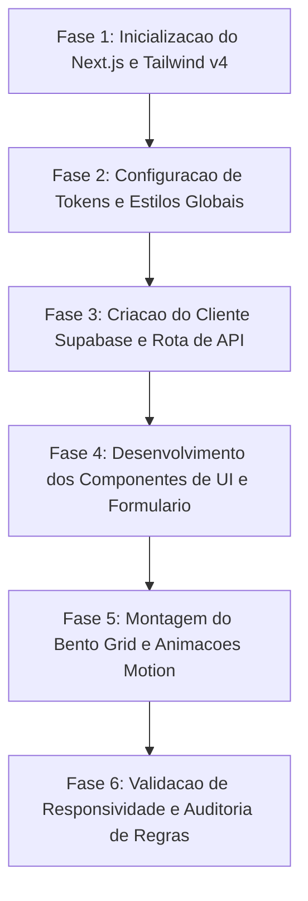

# Plano de Implementacao: Smartboi Lacta IA

Landing page de alta conversao para o Smartboi com foco no produto Lacta IA e otimizacao nutricional do rebanho leiteiro.

---

## 1. Visao Geral do Projeto

* **Produto Principal:** Lacta IA (medidor de pH para pequenos e medios produtores evitarem que leite com acidez elevada estrague o tanque no resfriador).
* **Proposta Secundaria:** Triagem e otimizacao da alimentacao do gado com base no historico de qualidade do leite.
* **Publico Alvo:** Produtores de leite (pequena e media escala), cooperativas e tecnicos agricolas.
* **Stack Tecnologica:**
  * Framework: Next.js (App Router, React 19)
  * Estilizacao: Tailwind CSS v4
  * Backend e Persistencia: Supabase Cloud (PostgreSQL com RLS)
  * Animacoes: Motion (motion/react, intensidade sutil)
  * Validacao e Tipagem: Zod + TypeScript
  * Iconografia: Lucide React

---
   
## 2. Identidade Visual e Design Tokens

Paleta de cores estritamente controlada e bloqueada para o projeto:

| Token | Hex | Funcao no Layout |
| :--- | :--- | :--- |
| `bg-primary` | `#F7F8F9` | Fundo principal da pagina e areas neutras |
| `bg-secondary` | `#D6E8DE` | Fundo secundario, cartoes em destaque e areas de enfase |
| `action-cta` | `#123C44` | Botoes principais, links de acao e elementos de conversao |
| `text-primary` | `#123C44` | Titulos principais e texto de alto contraste |
| `text-muted` | `#4A5568` | Textos de apoio, legendas e descricoes secundarias |
| `border-soft` | `#D6E8DE` | Bordas e divisores discretos |

### Regras Tipograficas e Editoriais
* Tipografia: Familia Inter (Google Fonts / next/font/google).
* Regra Estrita de Formatacao: Proibido o uso de qualquer travessao no texto da interface e no codigo de apresentacao. Empregados apenas dois pontos, parenteses ou pontos finais.

---

## 3. Arquitetura de Pastas e Modulos

```text
c:\Users\paulo\Documents\SmartBoi\
├── .agents\
├── .env.local
├── .env.example
├── next.config.ts
├── package.json
├── tsconfig.json
├── supabase\
│   └── migrations\
│       └── 20261003_init_leads.sql
├── public\
│   ├── favicon.ico
│   ├── logo.svg
│   └── og-image.png
└── src\
    ├── app\
    │   ├── api\
    │   │   └── leads\
    │   │       └── route.ts
    │   ├── globals.css
    │   ├── layout.tsx
    │   └── page.tsx
    ├── components\
    │   ├── bento\
    │   │   ├── BentoCard.tsx
    │   │   ├── BentoGrid.tsx
    │   │   ├── FeedingOptimizationCard.tsx
    │   │   ├── LossPreventionCard.tsx
    │   │   └── RealtimePhCard.tsx
    │   ├── cta\
    │   │   └── FinalCtaSection.tsx
    │   ├── hero\
    │   │   ├── HeroSection.tsx
    │   │   ├── LeadCaptureForm.tsx
    │   │   └── ValueProposition.tsx
    │   ├── layout\
    │   │   ├── Footer.tsx
    │   │   └── Navbar.tsx
    │   └── ui\
    │       ├── Button.tsx
    │       ├── Input.tsx
    │       └── StatusBadge.tsx
    ├── lib\
    │   ├── motion.ts
    │   ├── supabase\
    │   │   ├── client.ts
    │   │   └── server.ts
    │   └── validations\
    │       └── lead.ts
    └── types\
        └── lead.ts
```

---

## 4. Modelagem e Esquema do Supabase Cloud

Script SQL para a criacao da tabela de leads e configuracao das politicas de seguranca de linha (RLS).

```sql
-- Criacao da tabela principal de leads
create table if not exists public.leads (
    id uuid default gen_random_uuid() primary key,
    created_at timestamp with time zone default timezone('utc'::text, now()) not null,
    name text not null,
    email text not null,
    phone text not null,
    farm_name text,
    daily_liters numeric,
    herd_size integer,
    status text default 'new' not null check (status in ('new', 'contacted', 'qualified', 'converted', 'archived')),
    utm_source text,
    utm_medium text,
    utm_campaign text
);

-- Indices de consulta e performance
create index if not exists idx_leads_created_at on public.leads (created_at desc);
create index if not exists idx_leads_email on public.leads (email);

-- Ativacao do Row Level Security
alter table public.leads enable row level security;

-- Politica publica para envio de formulario (apenas insercao)
create policy "Permitir insercao anonima de leads"
    on public.leads
    for insert
    to anon, authenticated
    with check (true);

-- Politica restrita para consulta (somente administradores autenticados)
create policy "Apenas administradores leem leads"
    on public.leads
    for select
    to authenticated
    using (true);
```

---

## 5. Especificacao Detalhada das Secoes da Landing Page

### 5.1 Barra de Navegacao (Navbar)
* Logotipo Smartboi com tipografia Inter e icone estilizado.
* Etiqueta de status: "Lacta IA em fase de demonstracao".
* Botao de CTA rapido com scroll suave para a area de contato.

### 5.2 Secao Hero
* **Headline Principal:** Evite que uma unica ordenha azeda estrague todo o tanque de resfriamento.
* **Sub-headline:** O medidor digital e inteligente de pH que alerta antes do despejo no tanque comunitário ou próprio, protegendo seu faturamento diario.
* **Elemento Visual Interativo:** Mockup animado de um sensor portatil medindo o pH do leite com indicador verde (6.6 a 6.8 seguro) e alerta ambar/vermelho para risco de acidez.
* **Formulario de Captura:**
  * Campos: Nome completo, WhatsApp com DDD, Quantidade media de leite produzida por dia (litros).
  * Botao de submissao em `#123C44` com feedback de carregamento e confirmacao de sucesso.

### 5.3 Bento Grid de Beneficios e Valor
Disposicao em grade modular com 4 quadrantes estrategicos:

1. **Quadrante 1 (Destaque Principal): Prevencao de Perdas Totais no Tanque**
   * Explicacao direta do risco de contaminacao bacteriana e acidez elevada.
   * Alerta sonoro e visual instantaneo ao operador antes do leite entrar no resfriador.
2. **Quadrante 2: Otimizacao e Triagem Nutricional**
   * Cruzamento de dados de pH com a alimentacao fornecida no cocho.
   * Diagnostico precoce de acidose ruminal subaguda (SARA) atraves da composicao do leite.
3. **Quadrante 3: Calculadora de Retorno (ROI)**
   * Demonstrativo simples do valor de um lote de 1.000 litros salvo contra o custo unitario do sensor.
4. **Quadrante 4: Facilidade Operacional no Campo**
   * Feito para a rotina da sala de ordenha: resistente a umidade, leitura em segundos e higienizacao imediata.

### 5.4 Secao de CTA Final
* Bloco em container destacado com fundo `#D6E8DE`.
* Titulo de alta conversao: Transforme a qualidade do seu leite em maior rendimento por litro.
* Botao principal em `#123C44`: Falar com Especialista Smartboi.
* Garantia de atendimento rapido sem intermediarios.

### 5.5 Rodape
* Direitos reservados Smartboi.
* Links institucionais de conformidade com LGPD e termos de uso.

---

## 6. Ordem e Fases de Execucao



### Detalhamento das Etapas:
1. **Fase 1 (Scaffolding):**
   * Inicializar projeto Next.js com App Router e TypeScript.
   * Configurar dependencias: `@supabase/supabase-js`, `motion`, `lucide-react`, `zod`.
   * Criar arquivo de exemplo de variaveis de ambiente.

2. **Fase 2 (Design System & CSS):**
   * Definir variaveis customizadas no `globals.css` para a paleta bloqueada.
   * Carregar fonte Inter via `next/font/google`.

3. **Fase 3 (Integracao Supabase):**
   * Implementar `src/lib/supabase/client.ts` e `src/lib/supabase/server.ts`.
   * Criar schema de validacao com Zod em `src/lib/validations/lead.ts`.
   * Desenvolver endpoint `POST /api/leads`.

4. **Fase 4 (Construcao da Interface):**
   * Codificar `Navbar`, `HeroSection` e `LeadCaptureForm`.
   * Implementar microinteracoes e estados de loading.

5. **Fase 5 (Bento Grid e CTA Final):**
   * Criar componentes modulares do Bento Grid com cards de prevencao e nutricao.
   * Integrar `FinalCtaSection` e `Footer`.

6. **Fase 6 (Quality Assurance e Auditoria):**
   * Checagem rigorosa de ausencia total de travessoes no texto.
   * Teste do fluxo completo de submissao de lead no Supabase.
   * Validacao de contraste e acessibilidade.
